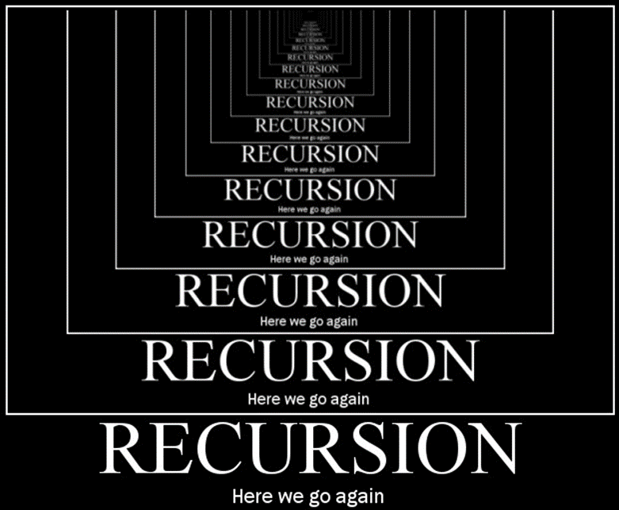
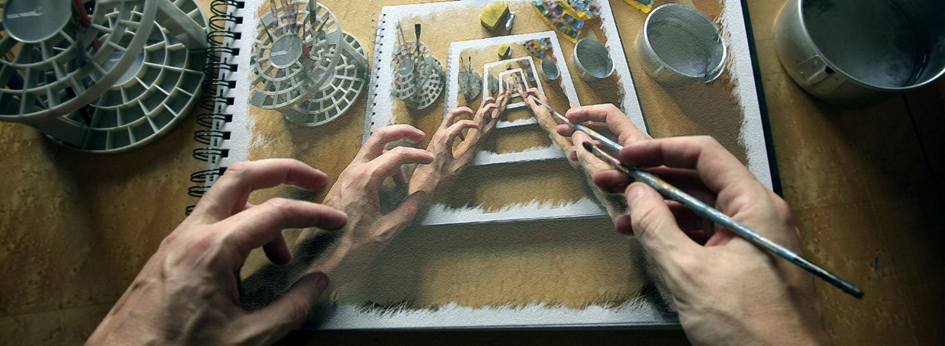
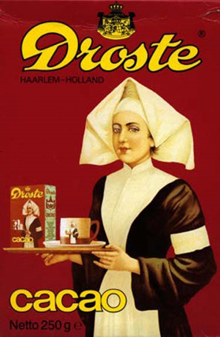
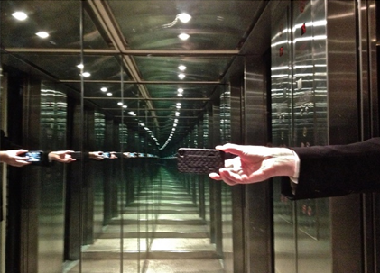

# 2 Recursie

# 2.1 Inleiding recursie


Het kan wel eens gebeuren dat je een probleem hebt waarvoor het best lastig is om een oplossing te vinden. Soms helpt het als je dan niet het hele probleem direct in één keer probeert op te lossen, maar dat je het probleem eerst een stapje klein maakt met een eenvoudige handeling en dat je dan vervolgens aan de slag gaat met het oplossen van de rest van het probleem. De rest van het probleem los je eigenlijk weer op de zelfde manier op: je maakt het probleem een stapje kleiner met een eenvoudige handeling en je lost de rest van het probleem op. Dit gaat net zolang door totdat er een restprobleem overblijft dat in één keer kan worden opgelost.

Dit idee is de basisgedachte achter een krachtig hulpmiddel waar gebruik van kan worden gemaakt om lastige klussen geklaard te krijgen: recursie. Kenmerkend voor recursie is dat een cruciaal deel van de oplossing bestaat uit het oplossen van één of meerdere kleinere identieke problemen (die op exact dezelfde manier worden opgelost).

Recursie wordt veelal geïllustreerd aan de hand van visuele effecten zoals de afbeelding aan het begin van deze inleiding, waarbij een deel van de afbeelding (de tekening waar de handen boven rusten) een kleinere versie is van de afbeelding zelf. Ook de afbeelding aan de rechterkant is een voorbeeld van recursie; het pak cacao bevat een afbeelding van een zuster die een dienblad in haar handen heeft met daarop een pak cacao. Op dat pak cacao is dus ook weer  een zuster afgebeeld met een pak cacao. Dit gaat zo oneindig lang door (het "Droste-effect").



Een ander voorbeeld is het beeld dat je krijgt als je twee spiegels recht tegenover elkaar plaatst, zoals op de foto links naast deze tekst.



Er zijn verschillende manieren waarop recursie kan worden toegepast. De vorm waarmee het basisidee van recursie werd beschreven bestond uit het kleiner maken van een probleem door het uitvoeren van eenvoudige handelingen en daarna vervolgens de rest van het probleem oplossen (op exact dezelfde manier).


**Los op (probleem):**
```
Als het probleem in één keer kan worden opgelost
	Los het probleem in één keer op
Anders
	Verklein het probleem met eenvoudige handelingen
    Los op (rest van het probleem)
```

Om de recursie te benadrukken zijn zowel de naam van de subroutine als de recursieve aanroep binnen de subroutine vetgedrukt.

Een voorbeeld hiervan is het sorteren van een rij getallen. Bij deze oplossing bestaat het sorteren uit de kleinste van de rij vooraan zetten en dan de rest van de rij verder sorteren (op precies dezelfde manier).

**Sorteer (getallen, vooraan, achteraan)**
```
Als vooraan<achteraan dan
    i := vooraan+1
    Zolang i <= achteraan
        Als getallen[vooraan]>getallen[i]
            Wissel (getallen[vooraan], getallen[i])
        i := i+1
    Sorteer (getallen, vooraan+1, achteraan)
```
Een andere vorm van recursie bestaat uit eerst een deel van het probleem op te lossen en daarna met behulp van dit deel van de oplossing de totale oplossing van het probleem maken door het uitvoeren van eenvoudige handelingen:

**Los op (probleem)**
```
Als het probleem in één keer kan worden opgelost
    Los het probleem in één keer op
Anders
    Los op (een deel van het probleem)
    Gebruik de oplossing van het deelprobleem om een oplossing te maken voor het totale probleem
```
Deze vorm van recursie kan ook worden gebruikt voor het sorteren van een rij getallen. Het is bijvoorbeeld mogelijk om een rij getallen te sorteren door het getal dat vooraan in de rij staat op de juiste plek te zetten, nadat je de rest van de rij eerst hebt gesorteerd.

**Sorteer (getallen, vooraan, achteraan)**
```
Als vooraan < achteraan
    Sorteer (getallen, vooraan+1, achteraan)
    i := vooraan
    Zolang (i < achteraan) en (getallen[i]>getallen[i+1])
        Wissel (getallen[i], getallen[i+1])
        i := i+1
```
Een derde vorm van recursie is een vorm waarin het probleem wordt opgeknipt in kleinere deelproblemen. Het oplossen van de deelproblemen gebeurt dan weer op exact dezelfde manier:

**Los op (probleem)**
```
Als het probleem in één keer kan worden opgelost
    Los het probleem in één keer op
Anders
    Los op (een deel van het probleem)
    Los op (de rest van het probleem)
    Gebruik de oplossingen van de deelproblemen voor oplossing voor het totale probleem
```
Deze vorm van recursie is een veel gebruikte techniek om getallen te sorteren. Een voorbeeld hiervan is MergeSort. Bij deze sorteermethode wordt eerst het linkerdeel van een rij getallen gesorteerd en het rechter deel van de rij. Om de totale rij gesorteerd te krijgen hoeven de getallen in het linkerdeel en het rechterdeel alleen nog maar te worden samengevoegd.

**Sorteer (getallen, vooraan, achteraan)**
```
Als vooraan < aantal
    midden := (vooraan+achteraan)/ 2	# naar beneden afgerond
    Sorteer (getallen, vooraan, midden)
    Sorteer (getallen, midden+1, achteraan)
    VoegSamen (getallen, vooraan, achteraan);
```
Het samenvoegen van het gesorteerde linkerdeel met het gesorteerde rechterdeel tot één gesorteerde lijst is nog wel een lastig karweitje. Dit wordt doorgaans gedaan met behulp van een hulprijtje:

**VoegSamen (getallen, vooraan, achteraan)**
```
midden := (vooraan+achteraan)/ 2	# naar beneden afgerond
i := vooraan
j := midden+1
plek := vooraan

Zolang (i<=midden) en (j<= achteraan)
    Als getallen[i] < getallen[j]
        hulprij[plek] := getallen[i]
        i := i+1
    Anders
        hulprij[plek] := getallen[j]
        j := j+1
    plek := plek+1

Zolang (i <= midden)
    hulprij[plek] := getallen[i]
    i := i+1
    plek := plek+1
Zolang (j <= achteraan)
    hulprij[plek] := getallen[j]
    j := j+1
    plek := plek+1

plek := vooraan
Zolang plek <= achteraan
    getallen[plek] := hulprij[plek]
    plek := plek+1
```
Alle genoemde voorbeelden tot dusver zijn voorbeelden van 'staartrecursie', een vorm van recursie waarbij een subroutine zichzelf aanroept. Het is ook mogelijk op een indirecte manier gebruik te maken van recursie. Deze vorm ontstaat wanneer een subroutine (A) niet zichzelf aanroept, maar een andere subroutine (B) van waaruit subroutine (A) weer wordt aangeroepen. In dit geval is sprake van 'wederzijdse recursie'.
