# 2.2 Voorbeelden

Er zijn veel typische problemen waarbij het gebruik van recursie erg handig kan zijn om tot een oplossing te komen. In dit hoofdstuk worden enkele van deze voorbeelden besproken.


## 2.2.1 Fibonacci
Één van de bekendste problemen waarvoor een eenvoudige recursieve oplossing bestaat, is de berekening van een Fibonacci getal. Fibonacci getallen vormen een rij (ook wel reeks van Fibonacci genoemd) die begint met 0 en 1 en waarbij elk volgende element van de rij steeds de som is van de twee voorgaande elementen: 0, 1, 1, 2, 3, 5, 8, 13, 21, 34, …

De rij van Fibonacci getallen wordt soms ook wel de konijnenrij genoemd. Het idee hiervan is dat met deze getallen de voortplantingssnelheid van konijnen wordt weergegeven.

De opdracht is om een programma te schrijven dat een bepaald (het N-de) Fibonacci getal berekent. De klassieke manier om dit te doen is:

**FiboWaarde(N)**
```
w1 := 0
w2 := 1
i := 1
Zolang i < N
    w2 := w1+w2
    w1 := w2-w1
    i := i+1
FiboWaarde := w1`
```

Het is ook mogelijk om met behulp van een recursieve oplossing te berekenen wat de waarde is van een bepaald Fibonacci getal. Deze oplossing volgt eigenlijk al direct uit de definitie van de Fibonacci getallen: de waarde van het eerste Fibonacci getal is 0, de waarde van het tweede Fibonacci getal is 1 en de waarde van alle overige Fibonacci getallen is de som van de waarden van de voorgaande twee Fibonacci getallen.

Hieronder is schematisch weergegeven op welke manier het zesde Fibonacci getal wordt berekend:

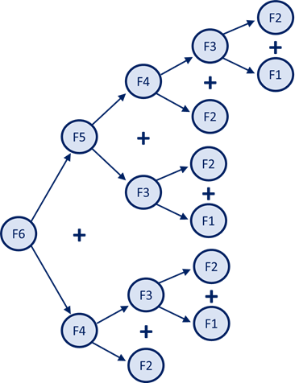

Een recursieve oplossing zou er als volgt uit zien:

**FiboWaarde(n)**
```
Als n <= 2 dan
    FiboWaarde := n-1
    Anders
        FiboWaarde := FiboWaarde(n-1) + FiboWaarde(n-2)
```

Let op: deze oplossing ziet er dan wel veel compacter uit, maar het niet recursieve algoritme is veel efficiënter. Kan jij uitleggen waarom dit zo is?

## 2.2.2 Sorteren (QuickSort)
Zoals eerder besproken is MergeSort een veel gebruikte recursieve sorteermethode. Een ander bekend sorteeralgoritme dat hier veel op lijkt is QuickSort. Het basisidee van QuickSort is dat het sorteren van een rij getallen bestaat uit het splitsen van de gegevens. Hiertoe wordt één van de waarden in de rij gekozen (de spil cq. de pivot). De waarden die kleiner zijn dan de spil komen aan de linkerkant en de waarde die groter zijn dan de spil komen aan de rechterkant (hierbij wordt er vanuit gegaan dat er in oplopende waarde gesorteerd moet worden). Om de gegevens in de rij in de juiste volgorde te krijgen hoeft nu alleen nog het linkerdeel en het rechterdeel te worden gesorteerd.

Als voorbeeld nemen we de onderstaande rij met gegevens:

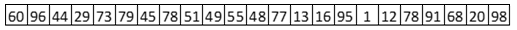

Er zijn verschillende manieren waarop de spil gekozen kan worden. In dit geval gaan we er vanuit dat hiervoor het eerste getal in de rij wordt genomen.

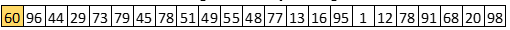

Na het splitsen zou de rij er als volgt uitzien:

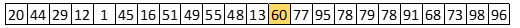

Aan de linkerkant staan alle waarden die kleiner zijn dan de spilwaarde (60) en aan de rechterkant staan de waarden die groter zijn. Om de totale rij gesorteerd te krijgen moet er nu opdracht worden gegeven om de eerste 12 getallen te sorteren (recursieve aanroep) en om de laatste 10 getallen te sorteren (recursieve aanroep).

Voor het sorteren van de waarden die links van de spil staan is een recursieve aanroep gedaan. Dit betekent dat manier waarop dit stuk van de rij gesorteerd wordt gelijk is aan de manier waarop de hele rij wordt gesorteerd. Ook dit stuk van de rij wordt dus gesplitst:

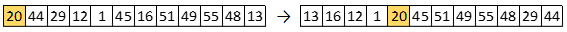

Vervolgens zouden de eerste 4 getallen gesorteerd moeten worden (recursieve aanroep) en tenslotte moeten ook de laatste 7 getallen in deze rij worden gesorteerd (recursieve aanroep). Hiermee zijn de eerste 12 getallen gesorteerd.

Om de totale rij gesorteerd te krijgen moeten ook de waarden die in de totale rij aan de rechterkant van de spil stonden (de waarden op plek 14 tm plek 23) worden gesorteerd. De opdracht hiertoe werd gegeven met een recursieve aanroep. Ook nu begint het sorteren van dit stuk van de rij met het splitsen ervan:

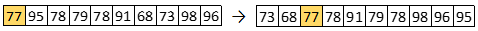

Met een recursieve aanroep worden de linker twee getallen in deze rij gesorteerd en met een recursieve aanroep worden ook de laatste 7 getallen in dit stuk van de rij gesorteerd. Hiermee zijn ook de laatste 10 waarden in de totale rij gesorteerd.

Een stukje van de rij waar slechts één waarde in staat is uiteraard al gesorteerd; er hoeft zo'n stukje niets te gebeuren.
In pseudocode ziet het QuickSort algoritme er als volgt uit:

**QuickSort (getallenrij, van, tot)**
```
Als van < tot
    Splits (getallenrij, van, tot, splitspunt)
QuickSort (getallenrij, van, splitspunt - 1)
QuickSort (getallenrij, splitspunt + 1, tot)
```

Er zijn verschillende manieren om (een stuk van) de rij te splitsen. Een algoritme dat hiervoor gebruikt kan worden is:

**Splits(getallenrij, van, tot, spil)**
```
spil := van
laatste = tot
Zolang spil < laatste
    Als (getallenrij[spil] > getallenrij[spil+1])
        Wissel (getallenrij[spil], getallenrij[spil+1])
        spil := spil+1
    Anders
        Wissel (getallenrij[spil+1], getallenrij[laatste])
        laatste := laatste-1
```

## 2.2.3 Torens van Hanoi
Er is een legende over een hindoe-tempel in de Indiase stad Benares onder keizer Fo Hi, waarvan de priesters, de Brahmanen, zich bezig houden met het verplaatsen van een toren van 64 gouden schijven.

De schijven liggen op drie naalden van diamant, een el lang en zo dik als het lichaam van een bij. In het begin liggen alle schijven opgestapeld over één naald, gesorteerd naar grootte (grootste onder, kleinste boven). Het werk is af wanneer alle schijven zijn verplaatst naar de naald waar de schijven uiteindelijk terecht moeten komen.

De priesters uit de legende hadden drie regels waarmee ze rekening moesten houden:
1. Een schijf ligt altijd over één van de drie pinnen.
2. Je mag maar een schijf tegelijk verplaatsen.
3. Je mag nooit een grotere schijf boven op een kleinere schijf leggen.

De opdracht is om een programma te schrijven dat de priesters precies vertelt welke schijven in welke volgorde verplaatst moeten worden.

Om te beginnen kijken we naar een stapel van 4 schijven. In het begin liggen alle schijven bij de eerste naald (naald 1). Het is de bedoeling dat ze uiteindelijk bij de derde naald (naald 3) uitkomen. Bij de verplaatsing mag gebruik worden gemaakt van een hulpnaald (naald 2).
Het idee van de recursieve oplossing is weergegeven door onderstaande afbeeldingen:

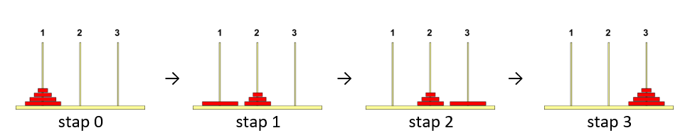

Om de hele stapel van naald 1 naar naald 3 te krijgen zal de onderste schijf moeten worden verplaatst van naald 1 naar naald 3. Dit is alleen mogelijk als de stapel die er bovenop ligt eerst tijdelijk wordt verplaatst naar naald 2 (stap 1). Zodra er geen schijven meer liggen op de onderste schijf, kan de schijf van naald 1 naar naald 3 worden verplaatst (stap 2). Daarna kan het stapeltje schijven dat tijdelijk op naald 2 is geparkeerd naar naald 3 bovenop de grootste schijf worden geplaatst (stap 4).

```
Verplaats 4 schijven van pin 1 naar pin 3 mbv pin 2:
Verplaats 3 schijven van pin 1, naar pin 2, mbv pin 3
    Verplaats schijf van pin 1 naar pin 3
    Verplaats 3 schijven van pin 2, naar pin 3, mbv pin 1
```

Hiermee is het probleem (het verplaatsen van 4 schijven) verkleint tot het verplaatsen van 3 schijven. Het verplaatsen van drie schijven van pin A, naar pin B, mbv pin C gebeurt op exact dezelfde manier:

* Verplaats 2 schijven van A, naar C, mbv B
* Verplaats een schijf van A naar B
* Verplaats 2 schijven van C, naar B, mbv A

Op deze manier reduceer je het probleem van het verplaatsen van een stapel steeds tot twee keer het verplaatsen van een stapel die één schijf kleiner is, met daar tussendoor het verplaatsen van één schijf. Als de stapel uit nog slechts één schijf bestaat dan kan je de verplaatsing direct uitvoeren.

**Verplaats Stapel (aantal schijven, van, naar, via)**
```
Als aantal schijven = 1
    Toon "Verplaats een schijf van ", van, " naar ", naar
Anders
    Verplaats Stapel (aantal schijven – 1, van, via, naar)
    Toon "Verplaats een schijf van ", van, " naar ", naar
    Verplaats Stapel (aantal schijven – 1, via, naar, van)
```

## 2.2.4 Koch kromme
In 1904 ontdekte de Zweedse wiskundige Helge von Koch een kromme, die nergens afleidbaar is: de Kromme Van Koch.
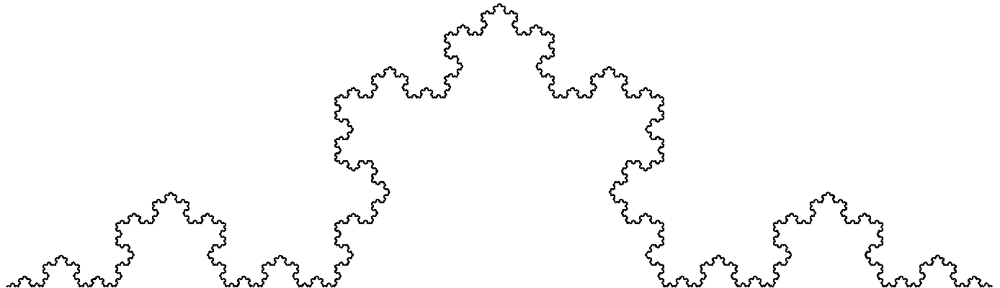

De meetkundige constructie van de Koch-kromme verloopt als volgt:
* Het begint met één lijnstuk.
* Dit lijnstuk wordt verdeeld  in drie gelijke delen.
* Het middelste gedeelte wordt vervangen door een gelijkzijdige driehoek zonder basis.
* In een volgende stap wordt dezelfde constructie toegepast op ieder lijnstuk van de vorige constructie. Op ieder lijnstuk van de zo ontstane nieuwe figuur wordt deze constructie weer toegepast.

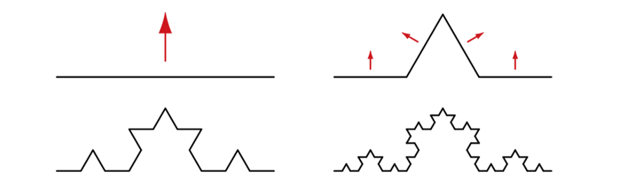

De limietfiguur die ontstaat door deze stappen herhaaldelijk uit te voeren noemt met de Kochkromme. In bovenstaande afbeelding is weergegeven hoe de Koch kromme er na 3 stappen uit ziet.

Het valt niet mee om een niet-recursief algoritme te ontwerpen voor het tekenen van de Koch kromme die ontstaat na een gegeven aantal stappen. Het is daarentegen een stuk eenvoudiger om een algoritme te vinden waarin wel gebruik wordt gemaakt van recursie.

Het algoritme zou er dan als volgt uit zien:

**TekenKoch (x1, y1, x2, y2, stappen)**
```
Als stappen=0 dan
    TekenLijn (x1, y1, x2, y2)
Anders
    BerekenHoekpunten (x1, y1, x2, y2, x3, y3, x4, y4, x5, y5)
    TekenKoch (x1, y1, x3, y3, stappen-1)
    TekenKoch (x3, y3, x5, y5, stappen-1)
    TekenKoch (x5, y5, x4, y4, stappen-1)
    TekenKoch (x4, y4, x2, y2, stappen-1)
```
In dit recursieve algoritme wordt gebruik gemaakt van een subroutine waarmee voor het lijnstuk (x1, y1),(x2, y2) wordt berekend wat de coördinaten zijn van de gelijkzijdige driehoek (x3,y3), (x4,y4) en (x5,x5).

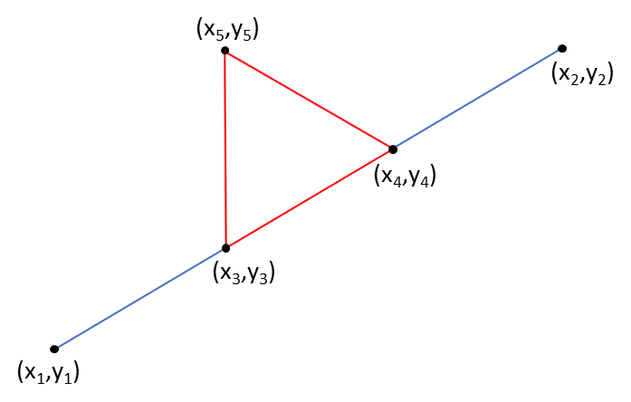

Voor de theorie over recursie is het niet relevant om te weten op welke manier de coördinaten van de hoekpunten van de gelijkzijdige driehoek berekend kunnen worden. Het is daarom geen punt als je de verdere uitwerking van de subroutine ``BerekenHoekpunten`` overslaat en verder gaat bij paragraaf 2.2.5.

Met de subroutine ``BerekenHoekpunten`` worden de hoekpunten (x3,y3), (x4,y4), en (x5,y5) berekend van de gelijkzijdige driehoek waarmee het middelste deel van het lijnstuk tussen de coördinaten (x1, y1) en (x2, y2) wordt vervangen.

De x-coördinaat van x3 kan je berekenen door 1/3 van het verschil tussen x1 en x2 op te tellen bij x1:

	x3 = x1 + (x2-x1) / 3

Op een vergelijkbare manier kan ook x4 worden uitgerekend:

	x4 = x2 – (x2-x1) / 3

Ook voor de bijbehorende y-coördinaten kan deze manier worden gebruikt:

	y3 = y1 + (y2-y1) / 3
	y4 = y2 – (y2-y1) / 3

De berekening van het coördinaat (x5,y5) is een stuk lastiger. Hiervoor wordt eerst de coördinaat (xm,ym) van het midden tussen (x3,y3) en (x4,y4) berekend. Dit punt is tevens het midden tussen (x1, y1) en (x2, y2).

    xm = (x1+x2)/2
	ym = (y1+y2)/2

Omdat de driehoek (x3,y3), (x4,y4),(x5,y5) een gelijkzijdige driehoek is, is de lengte van het lijnstuk (xm,ym),(x5,y5) gelijk aan de wortel van 3 keer de helft van de lengte van de zijde van de driehoek, met andere woorden: wortel 3 keer één-zesde van de lengte van het lijnstuk (x1, y1),(x2, y2). Het lijnstuk (xm,ym),(x5,y5) staat loodrecht op het lijnstuk (x1, y1),(x2, y2), 90 linksom; x5 is hierdoor xm plus wortel 3 keer één-zesde, keer het verschil tussen y2 en y1. De waarde van y5 krijg je door wortel 3 keer één-zesde, keer het verschil tussen x1 en x2 op te tellen bij ym.

Dit betekent dat het coördinaat (x5,y5) als volgt kan worden berekend:

    x5 = xm + ( wortel (3) / 6 ) x (y2-y1) ) 	=	(x1+x2)/2 + ( wortel (3) / 6 ) x (y2-y1) )
    y5 = ym + ( wortel (3) / 6 ) x (x1-x2) ) 	= 	(y1+y2)/2 + ( wortel (3) / 6 ) x (x1-x2) )

**BerekenHoekpunten (x1, y1, x2, y2, x3, y3, x4, y4, x5, y5)**
```
x3 := x1 + (x2-x1) / 3
y3 := y1 + (y2-y1) / 3
x4 := x2 – (x2-x1) / 3
y4 := y2 – (y2-y1) / 3
x5 := (x1+x2)/2 + ( (Wortel(3)) / 6 ) * (y2-y1) )
y5 := (y1+y2)/2 + ( (Wortel(3)) / 6 ) * (x1-x2) )
```

### 2.2.5	Dames op een schaakbord
Een ander probleem waarbij het gebruik van recursie erg handig kan zijn om tot een oplossing te komen is het probleem van de 8 dames op een schaakbord. Een dame kan zich in rechte lijnen verplaatsen over het bord: horizontaal, verticaal en diagonaal. Een stuk dat in dezelfde kolom, rij of diagonaal staat als een dame kan door deze dame in één beweging van het bord worden geslagen.

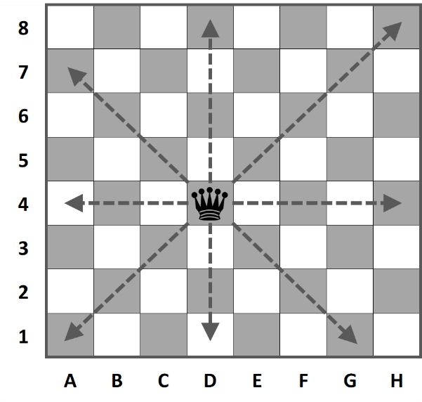

We willen nu bekijken wat het maximum aantal dames is dat op een schaakbord kan worden geplaatst zonder dat de dames elkaar kunnen slaan.

Het is in ieder geval niet mogelijk om meer dan 8 dames op het schaakbord te plaatsen. Probeer voor jezelf te ontdekken waarom dit niet mogelijk is.
Een standaard oplossing voor dit probleem is:

```
Maak het bord leeg
begin op de eerste rij (rij := 1)
begin met de eerste kolom (kolom := 1)

Zolang er nog niet op alle rijen een koningin is geplaatst (m.a.w. rij <= 8)
    Zoek een veld op deze rij waar een koningin niet kan worden geslagen
    Als er een veld op deze rij is gevonden
        Plaats de koningin op het gevonden veld
        Ga naar de volgende rij (rij := rij + 1)
        Begin met de eerste kolom (kolom := 1)
    Anders
        Ga terug naar de vorige rij (rij := rij – 1)
        Zoek in welke kolom de koningin staat
        Haal de koningin van dit veld
        Ga verder zoeken vanaf de volgende kolom

ToonOplossing
```
Dit programma zal stoppen bij de eerste mogelijkheid die door het programma wordt gevonden om 8 dames op een schaakbord te plaatsen.

Merk op dat dit algoritme er al vanuit gaat dat er in ieder geval een mogelijkheid gevonden zal worden. Als dit niet zeker is zal de zolang-conditie moeten worden uitgebreid met een test of de rij nog groter is dan 0. Bovendien moet er voor ToonOplossing een extra test worden geplaatst ``(Als rij > 8 dan)``.

Dit idee kan ook recursief worden opgelost. De basisgedachte hierbij is dat het plaatsen van N dames op een schaakbord bestaat uit het plaatsen van één dame op een rij, waarna er nog N-1 dames op de overige rijen geplaatst moeten worden.

In pseudocode ziet de recursieve oplossing er als volgt uit:

**PlaatsKoninginnen (aantal)**
```
Als aantal = 0 dan
    ToonOplossing
Anders
    rij := 9-aantal
    kolom := 1
    Zolang kolom < 9
        Als veld vrij dan
            Zet_Koningin_Op_Veld (rij, kolom)
            PlaatsKoninginnen (aantal-1)
            Neem_Koningin_Van_Veld (rij, kolom)
        kolom := kolom + 1
```
Het zoeken wordt opgestart met het volgende commando: ``PlaatsKoninginnen (8)``. Met dit algoritme wordt niet slechts één oplossing gevonden, maar het zal alle mogelijke oplossingen tonen.

Bij de niet-recursieve oplossing was het nodig om het programma aan te passen als je er niet vanuit mag gaan dat er een oplossing gevonden zal worden. Bedenk of dit ook bij de recursieve oplossing nodig is.


```elm

```
