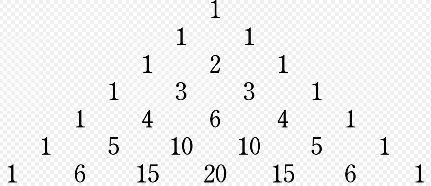

## 3.3 Intro Lists

Typ eens in (en laat Runnen):

List.range 1 9


```elm

```

Hee, hoe komt dat? Blijkbaar wordt er een 'lijstje' (`List`) van getallen opgebouwd.

### 3.3.1 Lijsten creëren

Een andere manier om een List te creëren is:

[ 3 , 5 , 6 , 8 ]


```elm

```

ofwel het simpelweg opsommen wat er in moet komen.
Voorbeeld met woorden/strings er in:

[ "abra" , "ca" , "dabra" ]


```elm

```

Je ziet bij die 2 voorbeelden in het resultaat wat het type van de elementen is. Wat als we strings en ints mixen?

[ "abra" , 5 , "dabra" ]


```elm

```

Een bijzondere versie van het opsommen van de elementen is het aanmaken van de lege List: een List zonder elementen. Dat doe je zo (eigenlijk ook op de 'opsom-manier', door 0 elementen op te sommen):

[]


```elm

```

Dat lijkt misschien niet zo bijzonder maar een lege lijst is bij het werken met
lijsten net zo belangrijk als de getallen 0 en 1 bij optellen en vermenigvuldigen.
Ook kun je aan een bestaande List met behulp van :: een element toevoegen:

42 :: (List.range 1 9)


```elm

```

en ook meerdere elementen toevoegen kan:

83 :: 42 :: (List.range 1 9)


```elm

```

Zoals je ziet zijn haakjes hier niet nodig. Op deze manier kun je een bestaande
List verlengen.

Om van een List het eerste element te krijgen bestaat de functie 'head':

List.head (83 :: 42 :: (List.range 1 9))


```elm

```

'Maybe'? Ja, want misschien was de List wel leeg en dan wordt er geen Int teruggegeven. Maybe is het een goed idee zelf op internet nog wat informatie op te zoeken, gebruik bijvoorbeeld de keywords 'elm lang List maybe'.

Nog een voorbeeld van Head:

List.head ([ "abra" , "ca" , "dabra" ])


```elm

```

Ook is het mogelijk juist allesbehalve het eerste element op te vragen: de 'tail':

List.tail (83 :: 42 :: (List.range 1 9))

List.tail ([ "abra" , "ca" , "dabra" ])


```elm

```


```elm

```

Als je er even over nadenkt zie je wellicht dat een List in essentie 2 verschillende vormen kan hebben: het is óf een lege List óf het is een element ('head' genaamd) gevolgd door een List (die ook weer leeg kan zijn óf bestaat uit een head en een List (de tail, die ook weer leeg kan zijn óf ... enzovoort)).

##### En tel er 2 bij op...

Het leuke van Lists is dat je er berekeningen op kunt gaan toepassen. Stel
we willen bij elk getal in de List het getal 2 optellen. We mappen dan de
functie telTweeOpBij op elk getal uit de List:
Met mappen wordt bedoeld: Het toepassen van de functie op elk van de items in de lijst.
(De functie telTweeOpBij hebben we eerder gezien, maar hier opnieuw):

telTweeOpBij x = x + 2


```elm

```

Deze functie kunnen we dus toepassen op elk element uit een List:

List.map telTweeOpBij (List.range 1 9)


```elm

```

We hadden in plaats van telTweeOpBij ook kunnen schrijven

List.map ( \x -> x + 2 ) (List.range 1 9)


```elm

```

waarbij \x -> x + 2 een anonymous function is zoals we al eerder gezien hebben.

Nu is:

List.map ( \x -> x + 2 ) (List.range 1 9)

niet bepaald super-leesbaar. Je mag dit in Elm ook anders opschrijven: Neem (List.range
1 9) en map op elk element de functie ( x -> x + 2 ). Dit ziet er dan in de Elm Repl uit
als:

(List.range 1 9) \

  |> List.map ( \x -> x + 2 )

(als je de 2 regels hierboven kopieert, haal dan de lege regel er tussen uit, anders werkt het niet!)


```elm

```

Een enkele backslash (\\) op het eind van een regel betekent dat het programma op de volgende regel doorgaat. Dit is niet nodig als je een 'normaal' Elm programma (dat is opgeslagen in een file) runt maar alleen in de 'Elm Repl'.

### 3.3.2 List.map functie

Met behulp van de map (List.map) kunnen we dus een functie toepassen op
elk element van een List.

List.map eenFunctie eenList

De functie eenFunctie wordt toegepast op eenList en het resultaat is een List
met evenveel elementen als eenList. Het i-de element van het resultaat is het
resutaat van toepassing van functie eenFunctie op de list eenList.
Stel ik wil alle kwadraten van de getallen 1 tot en met 30:

List.map ( \x -> x * x ) ( List.range 1 30 )


```elm

```

### 3.3.3 List.filter

De filter-functie (voluit: ’List.filter’) neemt als input een list en de output is
een lijst met (alleen die) elementen uit de input die aan een voorwaarde voldoen.
De voorwaarde wordt gesteld door een andere functie die (losgelaten
op een element van de list) true of false teruggeeft.

Zo geeft de functie ( \x -> x > 5 ) true terug als de input groter is dan 5 en anders
false. Kijken we naar:

List.filter ( \x -> x > 5) (List.range 1 30)


```elm

```

dan wordt er dus een list opgebouwd uit die elementen uit de range 1 tot en
met 30 die groter zijn dan 5.

##### Een uitdaging: Even, Oneven en Deling

Een voorbeeld: stel we willen alle oneven getallen van 1 tot 1000 opsommen. Een manier om dit te doen is de `list` te nemen van getallen van 1 tot 1000 en dan te filteren of een getal even of oneven is.
Om te kijken of een getal even of oneven is delen we het door 2 (deling van gehele getallen, dat wil zeggen geen komma-getallen).

In de informatica bestaan er 2 soorten deling: de `gewone deling` zoals je deze meestal tegenkomt (met breuken of kommagetallen; alsof je pizza's verdeelt) en de `integer deling` (alleen gehele getallen; alsof je snoepjes verdeelt):

Als je 13 pizza's verdeelt over 3 mensen (zullen wel kleine pizzaatjes zijn...) krijgt ieder 4 (hele) pizza's en ook nog een derde pizza. In Elm heet dit een `floating point division` en je gebruikt er de deelstreep `/` voor: `13 / 3`.

Als je daarentegen 13 snoepjes hebt en ze over 3 mensen eerlijk verdeelt krijgt ieder 4 snoepjes en heb je als het goed is nog 1 snoepje over (de `rest`, ook wel `modulo` genoemd). In Elm heet dit een `integer division`. Hoeveel snoepjes elk heeft kun je berekenen met `13 // 3` en hoeveel snoepjes er overblijven bereken je met `modBy 13 3`.

Om te weten of een getal `even` is (deelbaar door `2`) of `oneven` is kun je een `integer deling` door `2` doen en kijken of er `0` uitkomt, in `elm`:

`\x -> ( x % 2 == 0 )`

Als we deze functie toepassen op een oneven getal moet er `False` uitkomen en anders `True`:  

( \x -> ( modBy x 2 == 0 ) ) 15


```elm

```

( \x -> ( modBy x 2 == 0 ) ) 14


```elm

```

Voor het uitproberen van dit stukje code is dit een prima manier om te noteren, maar voor de leesbaarheid (en dus onderhoudbaarheid) van een programma is het goed er een duidelijke naam aan te geven (dus in plaats van de `anonymous functie` gaan we nu een `named function` programmeren):  

isEven x = ( modBy x 2 == 0 )


```elm

```

Waarna we het wat cryptische `( \x -> ( x % 2 == 0 ) ) 15` van hierboven kunnen versimpelen tot:

isEven 15


```elm

```

Om het helemaal af te maken definiëren we ook nog een function om te kijken of een getal `oneven` (`odd` in het Engels) is. Er zijn 2 voor de hand liggende manieren: je zou bijvoorbeeld kunnen kijken of een integer deling door 2 juist 1 oplevert, dus iets als `isOdd x = ( x % 2 == 1 )`, maar eleganter is misschien wel door `function` `isOdd` te definiëren als:

isOdd x = not ( isEven x )


```elm

```

ofwel: kijk of het getal `even` is en zet er `not` voor (`not True` geeft `False`, `not False` geeft `True`).

Kijk of 15 een oneven getal is:

isOdd 15

en 42?
en 83?
Komt eruit wat je verwacht?


```elm

```


```elm

```

Terug naar de uitdaging: We wilden alle oneven getallen van 1 tot 1000 opsommen. We laten nu alle getallen van 1 tot 1000 opsommen en gebruiken dan `List.filter` om de even getallen er uit te filteren zodat alleen de oneven getallen overblijven:  

List.filter isOdd ( List.range 1 1000 )


```elm

```

##### Probeer zelf:

Hoe krijg ik met behulp van List.map en/of List.filter van de getallen van 1
tot en met 60 die kwadraten die groter zijn dan 28?


```elm

```

### 3.3.4 List.foldl

Na de map en filter, die vrij intuïtief zijn als je ze een keer gezien hebt, komen
we bij de ’fold’. Deze komt voor als ’foldl’ en ’foldr’, misschien kun je al vermoeden
waar ’l’ en ’r’ voor staan?

We beginnen met een voorbeeld: Stel we willen weten hoeveel de getallen
van 1 tot en met 100 bij elkaar opgeteld zijn, dus

1 + 2 + 3 + 4 + 5 + ... + 99 + 100

Denk hier eerst een minuutje over na voor je verder leest. Als je wilt kun je het hier uitproberen:


```elm

```

We hebben al gezien dat we met (List.range 1 100) (een list met) de
getallen 1 tot en met 100 krijgen. Hoe krijgen we alle elementen uit de list
opgeteld? We doorlopen de lijst: elk element wordt bij het tussenresultaat
opgeteld. Dit lijkt wat op map, omdat op elk element van de list een berekening
wordt uitgevoerd, echter wordt de uitvoer/resultaat van de ene berekening gebruikt als invoer voor de volgende berekening.
Die berekening wordt geformuleerd als een functie:

( \x -> (\y -> x+y ) )


```elm

```

Aj, dat ziet er lastig uit...!? Valt mee als we het stapje voor stapje bekijken.
Het is een functie die als input een ’x’ verwacht. Dat is het element van de
list. Bij de eerste aanroep is dat dus 1, 2e aanroep een 2, 3e aanroep een 3 en
zo door. Deze functie geeft een andere functie terug:

( \y -> x+y )

een functie die een ’y’ ontvangt (het tussenresultaat, de optelling tot nu
toe) en een nieuw tussenresultaat berekent: in dit geval door bij het vorige
tussenresultaat de waarde van het huidige list-element op te tellen. Elm
zorgt ervoor dat het nieuwe tussenresultaat bij het volgende list-element
gebruikt wordt zodat we op het einde van de list alle elementen opgeteld
hebben!

We zijn er bijna! We moeten namelijk nog aangeven dat we bij het eerste
element willen beginnen met tussenresultaat 0!

Als we dit samenvoegen krijgen we:

List.foldl ( \x -> (\y -> x + y )) 0 (List.range 1 100)


```elm

```

Je ziet dat ’foldl’ als eerste parameter de ’berekeningsfunctie’ ontvangt, als
tweede de initiële waarde en tot slot de list waarop de berekening moet worden
toegepast.

We kunnen een functie ’telAllesOp’ definiëren die een list accepteert en alle
waarden optelt:

telAllesOp = List.foldl ( \x -> (\y -> x + y )) 0


```elm

```

Het is daarna mogelijk om van een list alle elementen op te tellen met

telAllesOp [42,512,4096]


```elm

```

##### Uitdaging

Definieer nu zelf aan de hand van het voorafgaande met behulp van folding
een functie die alle elementen van een list kwadrateert en die kwadraten dan bij elkaar optelt. Test deze met de
korte lijsten [3,4] en [5,12] (doen die je ergens aan denken? misschien als
je goed naar de resultaten kijkt: 25 en 169).

Definieer hier je functie:


```elm

```

en test deze met [3,4] en [5,12]:


```elm

```


```elm

```

### 3.3.5 List.foldr

Je had wellicht al bedacht dat ’l’ en ’r’ voor links en rechts staan. Als je het in
eerdergebruikt voorbeeld ’foldl’ vervangt door ’foldr’:

List.foldr ( \x -> (\y -> x + y )) 0 (List.range 1 100)


```elm

```

krijg je dan een ander resultaat? Snap je waarom?

Vergelijk ook de twee regels:

List.foldr ( \x -> (\y -> x ++ y )) "X" [ "a", "b", "c" ]

List.foldl ( \x -> (\y -> x ++ y )) "X" [ "a", "b", "c" ]


```elm

```


```elm

```

hier is het verschil heel duidelijk te zien.

#### Mogelijke challenge: Binomium

Misschien heb je wel eens gehoord van het binomium van Newton:



Het begint met het getal 1, daaronder komen rijen met steeds
links én rechts een 1. De andere getallen zijn steeds de 2 getallen er schuin
boven opgeteld. Misschien heb je wel eens een knikkerbaan gezien met spijkertjes
hetzelfde patroon:

Het getal dat in het binomium staat is gelijk aan het aantal ’wegen’ dat naar
een spijkertje leidt: een knikker die er van bovenaf in rolt kan steeds links
of rechts af. Het is bijvoorbeeld op 4 manieren mogelijk om bij een plek te
komen waar een 4 staat.

Van _aantal wegen_ is het een redelijk kleine stap naar de 'kans’ dat de knikker
op een bepaalde plek terecht komt. De getallen komen op veel plekken terug.

Het is best wel een challenge/uitdaging om een functie te schrijven die de i-de regel van het binomium oplevert!
