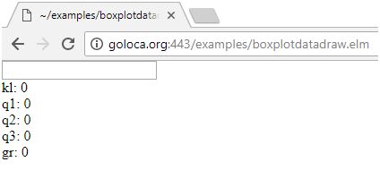

## Wat gaan we maken?
We gaan een boxplot maken. Als je niet weet wat een boxplot is lees dan de uitleg op:

[http://www.dr-aart.nl/Statistiek-boxplot.html](http://www.dr-aart.nl/Statistiek-boxplot.html)

Start het elm programma
[boxplotdatadraw.elm](http://goloca.org:443/examples/boxplotdatadraw.elm). Je ziet het volgende:

In het vakje kun je de waardes voor een boxplot invullen. Vul daar de volgende waardes in uit het voorbeeld van Dr. Aart:

`7,3,8,6,8,5,4,5,3,6,2,6,9,1,2,7,5,8,7,6` (Let op zet geen spaties na de komma’s).

Je ziet deze boxplot:

## Hoe gaan we een boxplot maken?

We gaan het vorige programma in Elm programmeren. Dit doen we met de volgende stappen.

.1. Maak een recursieve functie [mymergesort](mymergesort) om de lijst te sorteren.

.2. Maak functie [boxplotdata](myboxplotdata) om de gegevens voor een boxplot te bepalen.

.3. Maak functie [myboxplotdatadraw](myboxplotdatadraw) om op basis van de gegevens van een boxplot een boxplot te tekenen.
