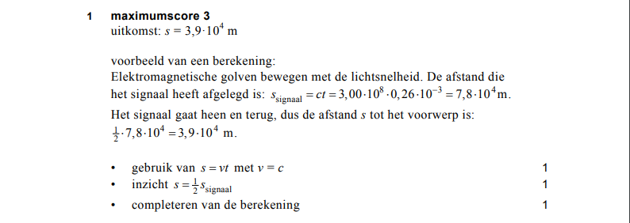
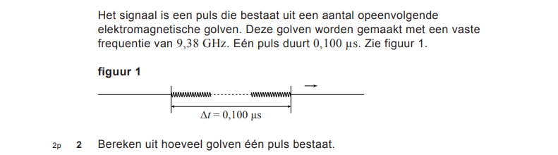
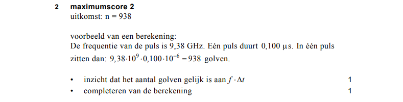
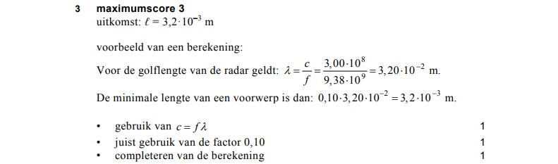
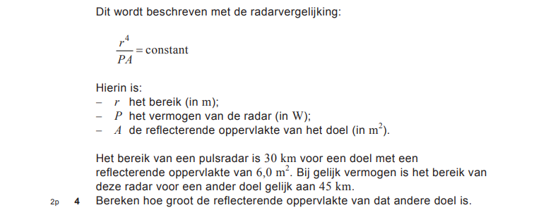
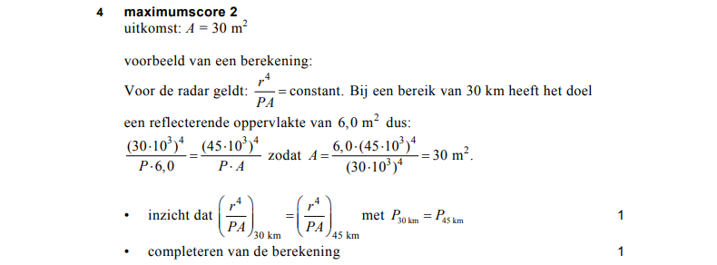

# Opgave Vraag1


# Antwoord Vraag1




# Algemene Uitwerking Vraag1
Bestudeer de Algemene Uitwerking van Vraag1


```elm
import Html exposing(..)
main = text ("Afstand = " ++ (toString afstand) ++ " m")

c = 3.0*(10^8)
milli g = g * 10^(-3)

s_signaal t = c * t
s_object t = 0.5 * (s_signaal t)

afstand = s_object (milli 0.26)
-- compile-code
```


# Opgave Vraag2




# Antwoord Vraag2




# Algemene Uitwerking Vraag2
Bestudeer de Algemene Uitwerking van Vraag1 en voeg de ontbrekende code toe aan de Algemene Uitwerking van Vraag2.


```elm
import Html exposing(..)
main = text ("Aantal golven = " ++ (toString aantalGolven))

c = 3.0 * 10^8

aantalGolven = ag (giga 9.38) (micro 0.1)
-- compile-code
```


# Opgave Vraag 3


# Antwoord Vraag3



# Algemene Uitwerking Vraag3
Voeg de code toe voor de Algemene Uitwerking van Vraag3.


```elm
import Html exposing(..)


-- compile-code
```


# Opgave Vraag4




# Antwoord Vraag4



# Algemene Uitwerking Vraag4
Bestudeer de Algemene Uitwerking van Vraag4.


```elm
import Html exposing(..)

main = text ("Oppervlakte = " ++ (toString oppervlakte))

kilo g = g * 10^3

opp a r1 r2 = a * (r2^4 / r1^4)

oppervlakte = opp 6.0 (kilo 30) (kilo 45)
-- compile-code
```
