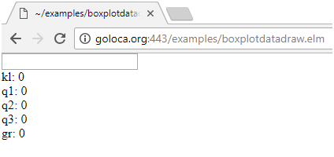
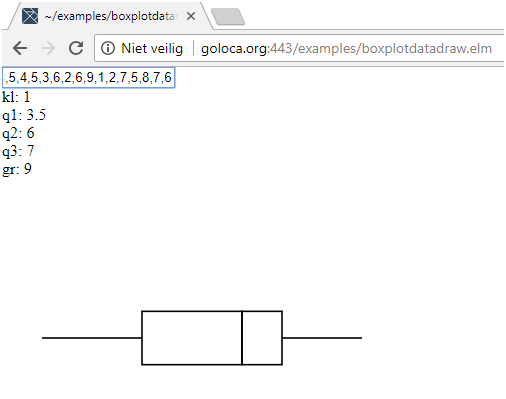

<p>Kopieer de code uit de vorige opdracht naar de cell hier onder.</p>

<p>Voeg&nbsp; bovenaan in <strong>myboxplotdatadraw.elm</strong> het volgende toe:</p>


<p>import Svg exposing (..)<br/>import Svg.Attributes exposing (..)</p>

<p>Vervang in <strong>myboxplotdatadraw.elm</strong>:</p>

<p>view model =</p>

<p>&nbsp; div []</p>

<p>&nbsp; [ input [onKeyDown KeyDown, onInput Input] []</p>

<p>&nbsp; , div [] [ text (toString model.outputData) ]</p>

<p>&nbsp; ]</p>

<p>door:</p>

<p>view model =<br />
&nbsp; let<br />
&nbsp; &nbsp; a = Array.fromList model.outputData<br />
&nbsp; &nbsp; kl = withDefault 0 (Array.get 0 a)<br />
&nbsp; &nbsp; k1 = withDefault 0 (Array.get 1 a)<br />
&nbsp; &nbsp; k2 = withDefault 0 (Array.get 2 a)<br />
&nbsp; &nbsp; k3 = withDefault 0 (Array.get 3 a)<br />
&nbsp; &nbsp; gr = withDefault 0 (Array.get 4 a)<br />
&nbsp; &nbsp; s = 200/(gr-kl)<br />
&nbsp; &nbsp; h = 12<br />
&nbsp; &nbsp; line1 = pointsListToString [kl&#42;s, 100, k1&#42;s, 100]<br />
&nbsp; &nbsp; box1 = pointsListToString [k1&#42;s, 100-(s&#42;((gr-kl)/h)), k2&#42;s, 100-(s&#42;((gr-kl)/h)), k2&#42;s, 100+(s&#42;((gr-kl)/h)), k1&#42;s, 100+(s&#42;((gr-kl)/h)), k1&#42;s, 100-(s&#42;((gr-kl)/h))]<br />
&nbsp; &nbsp; box2 = pointsListToString [k2&#42;s, 100-(s&#42;((gr-kl)/h)), k3&#42;s, 100-(s*((gr-kl)/h)), k3&#42;s, 100+(s&#42;((gr-kl)/h)), k2&#42;s, 100+(s&#42;((gr-kl)/h)), k2&#42;s, 100-(s&#42;((gr-kl)/h))]<br />
&nbsp; &nbsp; line2 = pointsListToString [k3&#42;s, 100, gr&#42;s , 100]<br />
&nbsp; in<br />
&nbsp; &nbsp; div []&nbsp;<br />
&nbsp; &nbsp; [ input [onKeyDown KeyDown, onInput Input] []<br />
&nbsp; &nbsp; , div [] [ Html.text (&quot;kl: &quot; ++ toString kl) ]<br />
&nbsp; &nbsp; , div [] [ Html.text (&quot;q1: &quot; ++ toString k1) ]<br />
&nbsp; &nbsp; , div [] [ Html.text (&quot;q2: &quot; ++ toString k2) ]<br />
&nbsp; &nbsp; , div [] [ Html.text (&quot;q3: &quot; ++ toString k3) ]<br />
&nbsp; &nbsp; , div [] [ Html.text (&quot;gr: &quot; ++ toString gr) ]<br />
&nbsp; &nbsp; , svg [ viewBox &quot;0 0 500 400&quot;, width &quot;800px&quot; ]<br />
&nbsp; &nbsp; &nbsp; [&nbsp;<br />
&nbsp; &nbsp; &nbsp; &nbsp; polyline [ fill &quot;none&quot;, stroke &quot;black&quot;, points line1 ] [],<br />
&nbsp; &nbsp; &nbsp; &nbsp; polyline [ fill &quot;none&quot;, stroke &quot;black&quot;, points box1 ] [],<br />
&nbsp; &nbsp; &nbsp; &nbsp; polyline [ fill &quot;none&quot;, stroke &quot;black&quot;, points box2 ] [],<br />
&nbsp; &nbsp; &nbsp; &nbsp; polyline [ fill &quot;none&quot;, stroke &quot;black&quot;, points line2 ] []<br />
&nbsp; &nbsp; &nbsp; ]<br />
&nbsp; &nbsp; ]</p>
<h3>Uitleg</h3>

<p>De gegevens voor de boxplot staan in model.outputData. Deze gegevens worden hier uit gehaald en in de volgende Floats gezet:</p>

<ul>
	<li>kl, kleinste</li>
	<li>k1, eerste quartiel</li>
	<li>k2, tweede quartiel</li>
	<li>k3, derde quartiel</li>
	<li>gr, grootste</li>
</ul>

<p>Deze Floats worden gebruikt om binnen een svg tag de volgende polylines aan te maken:</p>

<ul>
	<li>line1</li>
	<li>box1</li>
	<li>box2</li>
	<li>line2</li>
</ul>

<p>Zie <a href="https://www.w3schools.com/graphics/svg_polyline.asp">https://www.w3schools.com/graphics/svg_polyline.asp</a> als je meer over svg en polyline wilt weten.</p>

<h2>Resultaat</h2>
Run het elm programma in de cell hier onder. Je ziet het volgende:




In het vakje links boven kun je de waardes voor een boxplot invullen. Vul daar de volgende waardes in uit het voorbeeld van Dr. Aart:

7,3,8,6,8,5,4,5,3,6,2,6,9,1,2,7,5,8,7,6 (Let op zet geen spaties na de komma’s).

Druk op Enter en je ziet deze boxplot:




```elm

```
