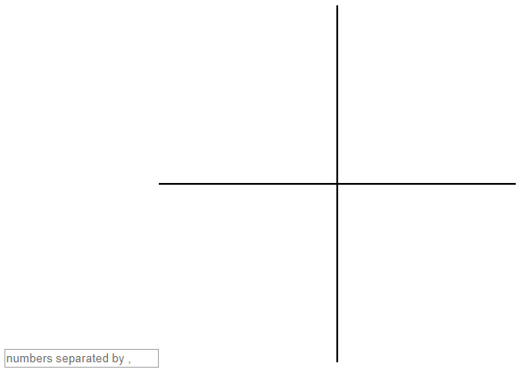

# Wat gaan we maken?

We gaan een programma maken dat een grafiek van een polynoom op het scherm afdrukt. Als je niet weet wat een polynoom is lees dan de uitleg op:

[https://nl.wikipedia.org/wiki/Polynoom](https://nl.wikipedia.org/wiki/Polynoom)

Start het elm programma
[powfuncpointsdraw](powfuncpointsdraw). Je ziet het volgende:

In het vakje kun je de a, b en c invullen voor functies van de vorm:

y = ax2 + bx + c

Vul in het vakje 5 in.

Je ziet nu de grafiek voor de functie y=5 voor -100 =&lt; x =&lt; 100.

Vul in het vakje 1,0 in.

Je zie nu de grafiek voor de functie y=x voor -100 =&lt; x =&lt; 100.

Vul in het vakje 1,2 in en druk Enter.

Je zie nu de grafiek voor de functie y=x+2 voor -100 =&lt; x =&lt; 100.

Vul in het vakje 1,0,0 in en druk Enter.

Je zie nu de grafiek voor de functie y=x2 voor -100 =&lt; x =&lt; 100.

Vul in het vakje 1,0,-4 in en druk Enter.

Je zie nu de grafiek voor de functie y=x2-4 voor -100 =&lt; x =&lt; 100.

Vul in het vakje 1,2,-4 in en druk Enter.

Je zie nu de grafiek voor de functie y=x2+2x-4 voor -100 =&lt; x =&lt; 100.

Vul&nbsp; nog wat andere waardes in voor a, b en c in en kijk wat er gebeurt.&nbsp; Als je een half wilt invullen moet dat met 0.5 en een tiende met 0.1.

Vul vier getallen in en kijk wat er gebeurt.

<h2>Hoe gaan we het programma maken?</h2>

We gaan het vorige programma in Elm programmeren. Dit doen we met de volgende stappen.

1. Maak een recursieve functie [pow](mypow) die een macht berekent.
2. Maak een recursieve functie [powfunc](mypowfunc) die de waarde van `y` berekent voor de waarde van `x`.
3. Maak een recursieve functie [powfuncpoints](powfuncpoints) die de waarden van `y` berekent met powfunc voor -10 &lt;= x &lt;= 10
4. Gebruik het resultaat van [powfuncpoints](powfuncpointsdraw) om een grafiek te tekenen voor -100 &lt;= x &lt;= 100
